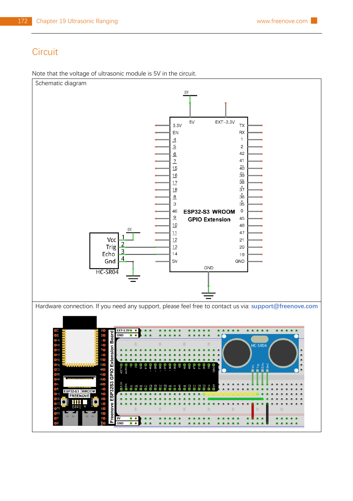

# Guided day prototype: Day 26 — Ultrasonic distance

Prototype for: [Prototype one guided day](https://github.com/skip-agent/freenove-esp32-s3-docs/issues/5)  
Map: [Wayfinder Map: TinySkiff ESP32-S3 guided 30-day tutorial spec](https://github.com/skip-agent/freenove-esp32-s3-docs/issues/1)

## Prototype status

This is a cheap content/page prototype, not production lesson copy. It tests how one complete guided day should feel when the lesson template, curriculum spine, official images, wiring notes, Arduino code, one challenge, debugging help, optional MicroPython side path, beginner explainers, theory, and agent-assist metadata all appear together.

Representative day chosen: **Day 26 — Ultrasonic distance**.

Why this day: it is mid/late enough to show real wiring, sensor behavior, serial output, measurement uncertainty, and debugging, but it avoids the extra complexity of BLE/Wi-Fi/network credentials.

> **Superseded by the generated lesson.** The hand-written prototype page has been retired. Day 26 is now built from `lessons/day-26-ultrasonic.yml` through the course pipeline and served at [`/course/day-26-ultrasonic/`](../course/day-26-ultrasonic/index.html). This document is kept as the original design write-up for issue #5.

---

# Day 26: Measure the room with sound

**Mission:** Build a tiny digital tape measure with the HC-SR04 ultrasonic sensor. You will wire the sensor, upload the Arduino sketch, and watch distance readings appear in Serial Monitor. Time: about **30 minutes**.

Today unlocks this idea: the ESP32-S3 can measure the physical world by timing how long a signal takes to leave and come back.

## Agent assist code

Use this when you want an agent to coach you through the lesson step by step:

```text
TSK-DAY26-ULTRASONIC
```

Agent context packet: [`/course/packets/TSK-DAY26-ULTRASONIC.json`](../course/packets/TSK-DAY26-ULTRASONIC.json) (generated from the lesson file).

Prompt idea:

> I am doing TinySkiff lesson `TSK-DAY26-ULTRASONIC`. Pull the lesson packet, then guide me one step at a time. Ask me to confirm each physical step before moving on. Explain any term I ask about in beginner-friendly language.

## What you need

- **ESP32-S3 board** with GPIO extension board, or breadboard setup.
- **HC-SR04 ultrasonic ranging module**.
- **4 female-to-male jumper wires**.
- **Arduino IDE**.
- Official sketch: `C/Sketches/Sketch_19.1_Ultrasonic_Ranging/Sketch_19.1_Ultrasonic_Ranging.ino`.
- Optional library-based variant: `Sketch_19.2_Ultrasonic_Ranging` with `UltrasonicSensor-1.1.0.zip`.

<div class="explainer-grid" markdown="1">

<details class="explainer"><summary>What is the ESP32-S3?</summary>
A small computer-on-a-chip mounted on your development board. It can run your code, read input pins, control output pins, and talk over USB, Wi-Fi, and Bluetooth. In this lesson, it is the brain that sends a ping signal and measures the echo.
</details>

<details class="explainer"><summary>What is the GPIO extension board?</summary>
A helper board that spreads the ESP32-S3 pins into easier-to-reach rows. GPIO means “general-purpose input/output”: pins your code can use to read signals or control things.
</details>

<details class="explainer"><summary>What is the HC-SR04?</summary>
An ultrasonic distance sensor. It has two round metal cans: one acts like a tiny speaker, the other acts like a tiny microphone. It sends a sound pulse humans cannot hear, then listens for the echo.
</details>

<details class="explainer"><summary>What are jumper wires?</summary>
Small removable wires for connecting parts without soldering. Female-to-male wires have a socket on one end and a pin on the other, useful for connecting a module to a breadboard or extension board.
</details>

<details class="explainer"><summary>What is Arduino IDE?</summary>
The program on your computer that opens the example sketch, compiles it, uploads it to the ESP32-S3, and lets you read messages from the board in Serial Monitor.
</details>

</div>

## Wiring map

Use the official circuit as the main image for this day. In production, crop/export this into a clean lesson asset and keep the Freenove attribution in the lesson source metadata.



**Alt text:** Official Freenove diagram showing HC-SR04 VCC connected to 5V, Trig to GPIO 13, Echo to GPIO 14, and GND to ground on the ESP32-S3 GPIO extension board.

**Source:** `source/Freenove_Super_Starter_Kit_for_ESP32_S3-main/C/C_Tutorial.pdf`, Chapter 19, page 172.

| HC-SR04 pin | Connects to | Why it matters |
|---|---|---|
| VCC | 5V | Powers the sensor. |
| Trig | GPIO 13 | The ESP32-S3 sends a short pulse from this pin. |
| Echo | GPIO 14 | The sensor returns a timed pulse on this pin. |
| GND | GND | Gives the board and sensor the same electrical reference point. |

<details class="theory"><summary>In case you do not know the pins yet</summary>

- **VCC** usually means the positive power connection for a part.
- **5V** is the voltage this official circuit uses to power the ultrasonic sensor.
- **Trig** is short for trigger. The ESP32-S3 briefly turns this pin on to start a measurement.
- **Echo** carries the return pulse. The longer it stays high, the farther away the object is.
- **GND** means ground. It is the shared “zero point” that lets the parts agree what a voltage means.

</details>

> **Check before power:** Keep the sensor pins in the same left-to-right order shown on the module: `VCC`, `Trig`, `Echo`, `GND`. Power off or unplug USB before moving wires. The official circuit uses 5V for the ultrasonic module.

## Build steps

1. Place the HC-SR04 sensor so the two round transducers face outward, away from loose wires.
2. Connect the four wires using the table above: `VCC → 5V`, `Trig → GPIO 13`, `Echo → GPIO 14`, `GND → GND`.
3. Pause and compare your wiring to the diagram. The two signal wires should land on GPIO **13** and **14**.
4. Open `Sketch_19.1_Ultrasonic_Ranging.ino` in Arduino IDE.
5. Upload the sketch to the ESP32-S3.
6. Open **Serial Monitor** and set the baud rate to **115200**.
7. Hold a flat object 10–30 cm in front of the sensor. Move it slowly closer and farther away.

<details class="explainer"><summary>What is Serial Monitor?</summary>
Serial Monitor is the little text window in Arduino IDE where the board can print messages back to your computer. Today it is how the ESP32-S3 shows the distance it measured.
</details>

## Code focus

You do not need to understand the whole sketch today. Watch these three ideas:

```cpp
#define trigPin 13
#define echoPin 14

pingTime = pulseIn(echoPin, HIGH, timeOut);
distance = (float)pingTime * soundVelocity / 2 / 10000;
```

<div class="explainer-grid" markdown="1">

<details class="explainer"><summary>What does <code>#define trigPin 13</code> mean?</summary>
It gives pin 13 a readable nickname: <code>trigPin</code>. Later code can say <code>trigPin</code> instead of remembering the number 13.
</details>

<details class="explainer"><summary>What does <code>pulseIn(...)</code> do?</summary>
It waits for a pin to go HIGH, measures how long it stays HIGH, and returns that time in microseconds. Here, that time is the echo’s round trip.
</details>

<details class="explainer"><summary>Why divide by 2?</summary>
The sound travels two distances: sensor → object, then object → sensor. You only want the one-way distance, so the code divides the round-trip distance by 2.
</details>

<details class="explainer"><summary>Why divide by 10000?</summary>
The code is converting from microseconds and meters-per-second into centimeters. The exact unit conversion is less important today than the model: time × speed gives travel distance.
</details>

</div>

> **Why this works:** The HC-SR04 sends a sound pulse above human hearing. When the pulse hits an object, some of it bounces back. The ESP32-S3 measures the return time and turns that into centimeters using the speed of sound.

## Understand the theory

The useful mental model is:

```text
send a ping → wait for echo → measure time → convert time into distance
```

The physics is the same idea as counting seconds between lightning and thunder. If you know how fast the signal travels, and you know how long it traveled, you can estimate distance.

For this sensor:

```text
distance = speed of sound × echo time ÷ 2
```

The reading is not magic and not just memorized code. The code is doing three jobs:

1. **Start the measurement:** send a short HIGH pulse on `Trig`.
2. **Time the response:** measure how long `Echo` stays HIGH.
3. **Convert units:** turn that time into centimeters.

<details class="theory"><summary>Why readings wobble a little</summary>
Real sensors are imperfect. A soft object may absorb sound. A curved object may bounce sound away. A hand may move while measuring. Air temperature changes the speed of sound slightly. Small changes in readings are normal; the important thing is that the number moves in the right direction when the object moves.
</details>

<details class="theory"><summary>Why a flat object works better</summary>
A flat object, like a book or wall, reflects more of the sound pulse straight back to the sensor. A round, soft, or angled object scatters the sound, so the echo can be weaker or inconsistent.
</details>

## Test

You should see lines like this in Serial Monitor:

```text
Distance: 24.31cm
Distance: 23.92cm
Distance: 24.08cm
```

A good reading should change when you move the object. It may wobble a little; that is normal for a real sensor.

## If it does not work

- **All readings are `0cm` or do not change:** check `Trig → GPIO 13` and `Echo → GPIO 14`; swapping them is easy.
- **Serial Monitor is blank:** confirm the baud rate is **115200** and the board/port are still selected.
- **Readings jump wildly:** use a flat object like a book, aim the sensor straight at it, and stay at least a few centimeters away.
- **Upload fails:** try a known data-capable USB cable and reselect the ESP32-S3 board/port.

<details class="explainer"><summary>Why troubleshooting starts with wiring</summary>
Physical computing fails in boring ways first: wrong pin, loose wire, no shared ground, wrong board/port, or a charge-only USB cable. Checking those before changing code saves time and protects your working baseline.
</details>

## Try this: make a mini range log

Measure three objects or distances:

| Target | Expected distance | Reading you saw | Notes |
|---|---:|---:|---|
| Book |  |  |  |
| Wall |  |  |  |
| Your choice |  |  |  |

Then pick one “keep-out zone” distance. For example: “If something is closer than 15 cm, that is too close.” You do not need to code the alert today; just choose the threshold and write down why.

<details class="theory"><summary>Why choose a threshold?</summary>
A threshold turns a changing measurement into a decision. Later projects can use the same pattern: if distance is less than 15 cm, beep; if it is greater, stay quiet. This is the bridge from “sensor reading” to “interactive device.”
</details>

## Optional MicroPython side path

Same circuit, different language. If you already have the MicroPython setup working, open:

`Python/Python_Codes/18.1_Ultrasonic_Ranging/Ultrasonic_Ranging.py`

The pins are the same:

```python
trigPin = Pin(13, Pin.OUT, 0)
echoPin = Pin(14, Pin.IN, 0)
```

Run it in Thonny and compare the printed distance with the Arduino version. If MicroPython is not already set up, skip this box; it should never block the Arduino-first day.

<details class="explainer"><summary>Why show MicroPython at all?</summary>
It reinforces the concept: the circuit and sensor behavior stay the same even when the programming language changes. The main course stays Arduino-first, but this optional box helps curious learners see the underlying pattern.
</details>

## Logbook

- What did you measure today?
- Which reading seemed most stable?
- What would you build if the sensor could warn you when something gets too close?

---

## Page decisions this prototype suggests

- A guided day should start with a concrete mission and a time promise before theory.
- The wiring image belongs before the numbered steps, paired with a small pin table and alt text.
- Safety/debugging should be near the risky action, not in a generic daily boilerplate box.
- The code block should be a **code focus**, not the full official sketch pasted into the lesson.
- Beginner explainers should be click-to-open, close to the thing they explain.
- In the actual UI, explainers should appear as small contextual help controls that open inline near the item, not as bulky accordion blocks or a side popout that interrupts the reading flow.
- Each lesson item should include its official manual image or screenshot when one exists, with source attribution kept close to the asset.
- Theory should be an intentional layer: enough to build a mental model, not a textbook chapter.
- The page should be visually chunked into clear cards: parts, wiring, steps, code, theory, test/debug, challenge, and agent assist.
- The challenge should extend the same working setup and fit inside the 30-minute day.
- MicroPython should appear as a short optional side path after the Arduino main path is complete.
- Each lesson should expose an agent-assist code and machine-readable lesson packet so an agent can coach the learner with full context.
- Each lesson should preserve source metadata: official sketch path, PDF page/image source, alt text, and attribution.

## Review prompt

Does this layered version feel right: a simple main path, plus elegant contextual help for parts/code/theory when you want to understand more?
